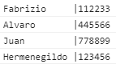
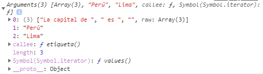

# ECMAScript 6
## const
La palabra const no define un valor constante sino que hace referencia constante a un valor. Por eso no podemos cambiar valores primitivos pero si podemos cambiar los valores de objetos.
```JavaScript
// Ejemplo 1
const PI = 3.1415
PI = 20     // Assignment to constant variable.

// Ejemplo 2
const persona = {
    nombre : "fabrizio",
    edad : 20
}
persona.nombre = "Juan"
console.log(persona)
persona.imprimir = function(){
    return `Soy ${this.nombre} y tengo ${this.edad} años` 
}
console.log(persona.imprimir())

// Ejemplo 3
const arreglo = [1,2,3]
console.log(arreglo)
arreglo.push(5)
console.log(arreglo)
```
## Strings
### startsWith()
Método que devuelve un valor booleano si la cadena indicada como argumento se encuentra al inicio de la cadena evaluado.
```JavaScript
let nombre="Fabrizio"
nombre.startsWith("F")  //true

// si indicamos un segundo parámetro, significa a partir de que indice de la cadena se va a evaluar
let nombre="Fabrizio"       // la letra "b" se encuentra en el indice 2
nombre.startsWith("b",2)    //true
```
### endsWith()
Muy parecido al método anterior, sólo que en este caso se evalúa al final de la cadena.
```JavaScript
let nombre="Fabrizio"
nombre.endsWith("o")    // true

// al indicar un segundo parámetro, esta significa la longitud de la cadena que se va a evaluar
let nombre="Fabrizio"
nombre.endsWith("b",3)  //true
```
### includes()
Método que retorna un valor booleano evaluando si la cadena que se pasa como argumento se encuentra dentro de la cadena que se va a evaluar.
```JavaScript
let nombre="Fabrizio"
nombre.includes("ab")   //true

//  al indicar un segundo parámetro, significa a partir de que indice de la cadena se va a buscar
let nombre="Fabrizio"
nombre.includes("ri",1) //true
```
### repeat()
Método que retorna una nueva cadena con un numero de copias de la cadena especificada.
```JavaScript
let texto='Hola'
texto.repeat(2)     //"HolaHola"
// si no se retorna nada o se indica el valor de 0, retornara una cadena vacia
texto.repeat()      //""
```
### padEnd()
Método que rellena al final de una cadena otra cadena (repetida, si es necesario) para poder llegar a la longitud indicada.
```JavaScript
let pais = "Perú"
// estamos indicando que se rellene al final de la cadena "pais" con "." hasta que tengan una longitud total de 20
pais.padEnd(20,".")     // "Perú................"

// si pasamos una longitud menor que la cadena, retorna la cadena misma
pais.padEnd(2)          //"Perú"

// si no se indica el parámetro, se completa con espacios en blanco
pais.padEnd(20)         // "Perú                "
```
### Ejercicio con repeat() y padEnd()
A partir de los nombres y numeros de cada persona, cada caracteristica en un arreglo, listarlos de la siguiente manera:     
   
Se ve que la columna entre nombre y numero tienen la misma longitud en todos los casos dependiendo de la longitud del nombre con la longitud más alta.

**Solución**
- repeat()
    ```JavaScript
    let nombre = ["Fabrizio","Alvaro","Juan","Hermenegildo"]
    let telefono = ["112233","445566","778899","123456"]

    function listarDatos(){
        let longitud = 1+cadenaMasLargo(nombre)
        for (const key in nombre) {
            let espaciado = longitud-nombre[key].length
            console.log(nombre[key]+" ".repeat(espaciado)+"|"+telefono[key])
        }
    }
    function cadenaMasLargo(object){
        let longitud=0
        for (const iterator of object) {
            if(iterator.length>longitud)    longitud = iterator.length
        }
        return longitud
    }

    listarDatos()
    ```
- padEnd()
    ```JavaScript
    let nombre = ["Fabrizio","Alvaro","Juan","Hermenegildo"]
    let telefono = ["112233","445566","778899","123456"]
    function listarDatos(){
        let longitud = 1+cadenaMasLargo(nombre)
        for (const key in nombre) {
            console.log(nombre[key].padEnd(longitud)+"|"+telefono[key])
        }
    }
    function cadenaMasLargo(object){
        let longitud=0
        for (const iterator of object) {
            if(iterator.length>longitud)    longitud = iterator.length
        }
        return longitud
    }

    listarDatos()
    ```
## Template literal
Caracteristica que aparece en ES6/ES2015 que permite trabajar de una manera distinta con cadenas de texto.
```JavaScript
let nombre = 'Juanito'
let apellido = 'Alcachofa'
function nombreCompleto(nom,apel){
    return `${nom} ${apel}`
}
console.log(`Mi nombre completo es ${nombre} ${apellido} y tengo ${13+1} años`)
console.log(`Mi nombre completo es ${nombreCompleto(nombre,apellido)} y tengo ${13+1} años`)
```
Podemos ver que podemos usar codigo JavaScript(variables, expresiones, funciones) dentro de los template literal usando `${}`.
### tag en template literal
Una característica que posee los template string es que se las puede etiquetar.
Esto quiere decir podemos correr un template literal en una función y podemos determinar la creación de esta cadena de texto.
```JavaScript
function etiqueta(){
    
}
let pais = "Perú"
let capital = "Lima"
console.log(etiqueta`La capital de ${pais} es ${capital}`)
```
Estamos etiquetando el template literal a la función `etiqueta()`, esta función posee toma la información de todo el template literal (texto, datos de la variable). El navegador ejecutará la función y lo que retorne es lo que se mostrará, en este caso.
Para corroborar que esta función posee toda la información del template literal, veamos el objeto `argument`.
```JavaScript
// agregamos "return arguments" a la función etiqueta
function etiqueta(){
    return arguments
}
```
Imprime lo siguiente:
     
Vemos que retorna el objeto `arguments` donde el primer elemento es un arreglo que contiene todo el texto que se escribio en el template literal y los demás elementos son los datos de las variables del template literal.
#### Ejemplo
Hagamos que los datos de las variables en el template literal estén entre comillas dobles.
```JavaScript
function etiqueta(str,...args){
    let cadena = ''
    str.forEach(function(element, index){
        return cadena+=`${element} "${args[index] || ''}"`
    });
    return cadena
}
let pais = "Perú"
let capital = "Lima"
console.log(etiqueta`La capital de ${pais} es ${capital}`)
```
#### Uso
Podemos usar estas etiquetas para que cualquier valor que sea pasado en el template literal lo podamos poner entre la etiqueta html `<span></span>` y poder estilizarlo con CSS.
- Creamos un archivo style.css colocamos lo siguiente.
    ```CSS
    .highlight{
        background: red
    }
    ```
- Código JavaScript
    ```JavaScript
    function etiqueta(str,...args){
        let cadena=""
        str.forEach((elemento,indice)=>cadena+=`${elemento}<span class="highlight">${args[indice]||''}</span>`)
        return cadena
    }
    let pais = "Perú"
    let capital = "Lima"
    document.body.innerHTML =  etiqueta`La capital de ${pais} es ${capital}`
    ```
Y saldrá lo siguiente:  


### String.raw()
String.raw es una funcion de string templates que permite obtener un string crudo, quiere decir, el texto original y no interpretado
```JavaScript
let mensaje = `Hola\nmundo\\`
console.log(mensaje)
console.log(String.raw`Hola\nmundo\\`)
```
## Arrow functions
Propiedades:
- No hay creación de this,super,arguments,new.target
- No puede ser llamado con new.
- No tiene prototipos.
- No puede cambiar el this.
- No hay objeto arguments.
- No pueden tener nombre duplicados.
## `Object.is()`
Método que determina si dos valores son iguales o no.
Dos valores son iguales si cumplen los siguiente criterios.
- Ambos son `undefined`
    ```JavaScript
    Object.is(undefined,undefined)  //true
    ```
- Ambos son `null`
    ```JavaScript
    Object.is(null,null)            //true
    ```
- Ambos son `true` o `false`
    ```JavaScript
    Object.is(true,true)            //true
    Object.is(true,false)           //false
    ```
- Ambos son cadenas de texto y poseen la misma longitud con las mismas letras en el mismo orden.
    ```JavaScript
    Object.is("Hola",'Hola')        //true
    Object.is("Hola",'hola')        //false
    ```
- Ambos son número y son +0
    ```JavaScript
    Object.is(+0,+0)                //true
    ```
- Ambos son número y son -0
    ```JavaScript
    Object.is(-0,-0)                //true
    ```
- Ambos son valores numéricos o ambos son `NaN`
    ```JavaScript
    Object.is(-1,-1)                //true
    Object.is(NaN,NaN)              //true
    ```
Existen preguntas de, ¿Porqué usar este método y no usar los `==` o `===`?  
Veamos los siguientes casos:
```JavaScript
NaN==NaN                //false
NaN===NaN               //false
Object.is(NaN,NaN)      //true

+0===-0                 //true
+0==-0                  //true
Object.is(+0,-0)        //false
```
## `Object.assign()`
Permite copiar todas las propiedades de un objeto a otro.
```JavaScript
const receptor={
    pais : 'Perú'
}
const emisor = {
    nombre : 'Fabrizio',
    apellido : 'Condori',
    edad : 20
}
const proceso = Object.assign(receptor,emisor)
console.log(receptor)   //{pais: "Perú", nombre: "Fabrizio", apellido: "Condori", edad: 20}
console.log(emisor)     //{nombre: "Fabrizio", apellido: "Condori", edad: 20}
console.log(proceso)    //{pais: "Perú", nombre: "Fabrizio", apellido: "Condori", edad: 20}
```
## Prototipos
- `setPrototypeOf()`    
    Devuelve el prototipo de un objeto
    ```JavaScript
    const gato = {
        sonido(){
            console.log('Miau!')
        },
        chillido(){
            console.log('Miauuuuuuuu!')
        }
    }
    let angora = Object.create(gato)
    console.log(angora.__proto__)               //{sonido: ƒ, chillido: ƒ}
    console.log(Object.getPrototypeOf(angora))  //{sonido: ƒ, chillido: ƒ}
    ```
    Notamos que `angora.__proto__` brinda el mismo resultado que `Object.getPrototypeOf(angora)`.

- `getPrototypeOf()`
    Establece el prototipo de un objeto otro objeto en específico.
    ```JavaScript
    // Siguiendo con el ejemplo anterior
    const perro = {
        sonido(){
            console.log('Guauuu')
        }
    }
    Object.setPrototypeOf(angora,perro)
    console.log(Object.getPrototypeOf(angora))  // {sonido: ƒ}
    ```
## Desestructuración de objetos
```JavaScript
const data = {
    name     : 'Fabrizio',
    lastName : 'Condori',
    mail     : 'avbar357159@gmail.com',
    facebook : 'aaas',
    // twitter  : 'qqqqqq',
    premium  : true
}
let {lastName,name:nombre,mail,premium:pago,twitter:twit='aaaaa'}=data
console.log(nombre)     //Fabrizio
console.log(mail)       //avbar357159@gmail.com
console.log(lastName)   //Condori
console.log(pago)       //true
console.log(twit)       //aaaaa
```
En un objeto anidado
```JavaScript
const nodo = {
    nodo1 : 1,
    nodo2 : {
        nodo3:12,
        nodo4:{
            nodo5:23
        }
    }
}
const {nodo2:{nodo3,nodo4:{nodo5:subsubnodo}}} = nodo
console.log(subsubnodo)     //23
```

## Desestructuración de arreglos
```JavaScript
const listaFrutas = ['platano','pera','manzana']
let [fruta1,fruta2,fruta3] = listaFrutas
console.log(fruta1)     //platano
console.log(fruta2)     //pera
console.log(fruta3)     //manzana
let [,f2]= listaFrutas
console.log(f2)         //pera
```
Desestructuración de arreglos anidados
```JavaScript
let colores = ['rojo',['amarillo','verde','negro'],'azul','morado']
let [color1,[,color22]] = colores
console.log(color1)             //rojo
console.log(color22)            //verde
let listColors = ['rojo','amarillo','verde','negro','azul','morado']
let [mainColor,...secondaryColors]=listColors
console.log(mainColor)          //rojo
console.log(secondaryColors)    //(5) ["amarillo", "verde", "negro", "azul", "morado"]
```
**Ejemplo:** Intercambiar los valores de dos variables.
```JavaScript
let x=1;
let y=2;
console.log(x);     //1
console.log(y);     //2
[x,y] = [y,x];
console.log(x);     //2
console.log(y);     //1
```
## Simbolos
Es un tipo de dato que sus valores son unicos e inmutables.
```JavaScript
let simbolo = Symbol()
console.log(simbolo)    //Symbol()

// podemos darle una descripción al simbolo (conocido como nombre del simbolo)
let simbolo2 = Symbol('simbolo')
console.log(simbolo2)   //Symbol(simbolo)
```
La característica principal de los simbolos es que son únicos, aún si estos tienen la misma descripción ya que ésta es una etiqueta que no afecta en algo.
```JavaScript
let simbolo1 = Symbol('simbolo')
let simbolo2 = Symbol('simbolo')
console.log(simbolo1==simbolo2)             //false
console.log(simbolo1===simbolo2)            //false
console.log(Object.is(simbolo1,simbolo2))   //false
```
### Coerción
Los símbolos no pueden tener una conversión implícita a otro tipo de dato como los string's.
```JavaScript
let simbolo = Symbol('simbolo')
console.log(`Mi simbolo ${simbolo}`)        //Uncaught TypeError: Cannot convert a Symbol value to a string
```
Si queremos mostrar el simbolo, podemos hacer uso del método `.toString()` ó si queremos mostrar la descripción del simbolo usamos `.description`.
```JavaScript
let simbolo = Symbol('simbolo')
console.log(`Mi simbolo ${simbolo.toString()}`)     // Mi simbolo Symbol(simbolo)
console.log(simbolo.description)                    // simbolo
```
### Uso
Los simbolos nos permiten crear propiedades ocultas a los objetos, que no pueden sobre sobreescrito o accedido por otros.
```JavaScript
const persona = {
    nombre : 'Juan'
}
let id = Symbol('ID')
persona[id] = 123
console.log(persona[id])    //123
```
Si deseamos usarlo con objetos literales, usamos corchetes.
```JavaScript
let id = Symbol('ID')
const persona = {
    nombre : 'Juan',
    [id] : 123
}
```
**Nota:** Si iteramos el objeto con el bucle `for...in`, no podremos visualizar las propiedades simbolos.
```JavaScript
let id = Symbol('ID')
const persona = {
    nombre : 'Juan',
    [id] : 123
}
for (const key in persona) {
    console.log(key)                //nombre
}
```
Para poder acceder a las propiedades simbolos de un objeto, usamos `Object.getOwnPropertySymbols()` que retornará un arreglo con todos las propiedades simbolos del objeto.
```JavaScript
const simbolos = Object.getOwnPropertySymbols(persona)
console.log(simbolos)               //[Symbol(ID)]
```
### Simbolos globales
Entendemos que los simbolos son identificadores únicos, aunque tengan la misma descripción.
`Symbol.for('description')` busca simbolos existente registro de simbolos globales con la descripción enviada y retorna el simbolo si ha sido encontrado, sino crea un nuevo simbolo.
```JavaScript
let id = Symbol.for('id')
let id2 = Symbol.for('id')
let id3 = Symbol('id')
console.log(id==id2)        //true
console.log(id==id3)        //false
console.log(id2==id3)       //false
```
`Symbol.keyFor(sym)` retorna el nombre del simbolo, ésto usa el registro de simbolos globales, si un simbolo no se encuentra allí entonces retornara `undefined`.
```JavaScript
let id = Symbol.for('id')
console.log(Symbol.keyFor(id))  //id
```
## Set
Es un objeto que permite almacenar valores únicos de cualquier tipo.
```JavaScript
let items = new Set()

// .add() permite añadir elementos
items.add(1)
items.add(2)
items.add(3)
items.add(2)
items.add('1')

console.log(items)          //Set(4) {1, 2, 3, "1"}

//.size retorna el tamaño del set
console.log(items.size)     //4

//.delete(elemento) eliminar el elemento indicado en el parámetro
items.delete(1)
console.log(items)          //Set(3) {2, 3, "1"}

//.clear() elimina todos los elementos
items.clear()
console.log(items)          //Set(0) {}
```
### for each en set
```JavaScript
let items = new Set([1,2,4,5,3,5])
items.forEach(function(key,value,set){
    console.log(key,value,set)
})
```
Vemos que `key` y `value` tienen el mismo valor, mientras que el el parámetro `set` hace referencia al objeto mismo.
### set a arreglo
Si deseamos convertir el objeto set en un arreglo usamos el *operador spread*.
```JavaScript
let items = new Set([1,2,4,5,3,5])
function eliminarDuplicados(arreglo){
    return [...new Set(arreglo)]
}
```
Creamos una función donde elimina elementos duplicados de un arreglo primero convirtiendolo en un set y retorna el set convertido en un arreglo.

**Nota:** Existen los `WeakSet` que es un objeto que te permite almacenar y mantener solo **objetos** en una colección.
